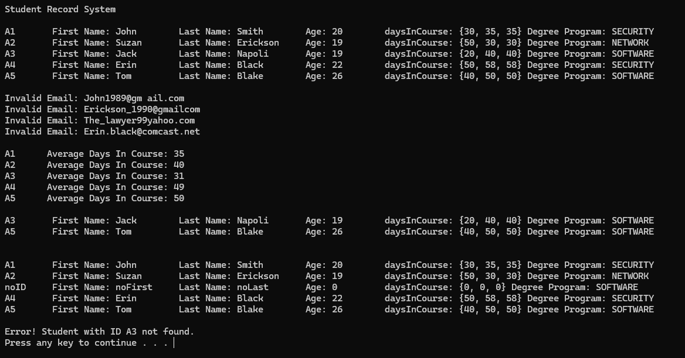

# Student Record System

The Student Record System is a C++ based application designed for managing and tracking student records in an academic setting. It allows for efficient handling of student data, including personal details, academic progress, and course management.

## Table of Contents

- [Languages Used](#languages-used)
- [Technologies Used](#technologies-used)
- [Features](#features)
- [Installation](#installation)
- [Usage](#usage)
- [License](#license)

## Languages Used

- C++

## Technologies Used

- Makefile for compilation and building

## Features

- Addition, removal, and management of student records.
- Capability to print all student details, including emails and average days in courses.
- Functionality to filter and display students by specific degree programs.
- Tools to validate and showcase invalid email addresses.

## Installation

Follow these steps to install and execute the project:

1. Clone the repository to your local system.
2. Move to the project's `src` directory.
3. Compile the project using the Makefile: `make all`.
4. Execute the compiled binary `main.exe`.

## Usage

Upon launching the executable, the application presents the results of a search for student records given the assignment's requirements. Users may insert new records, delete existing ones, and search the database for particular student details in the provided code files.

## License

[MIT License](LICENSE)
